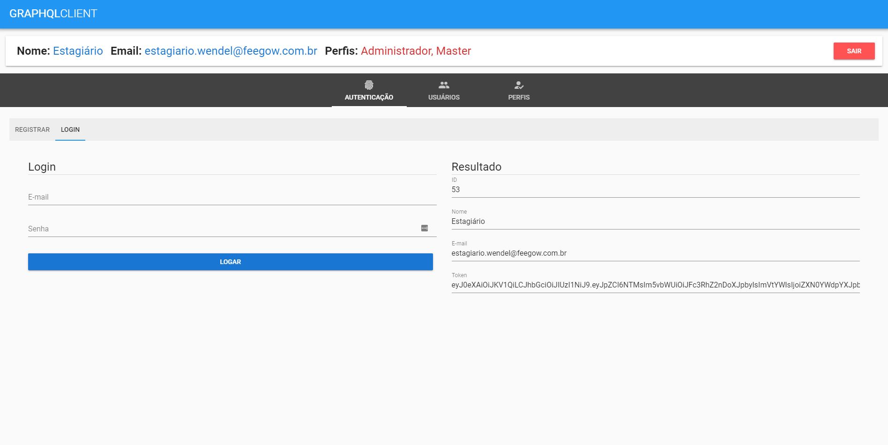
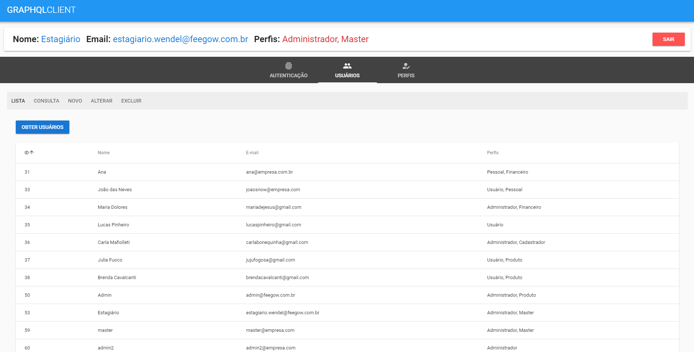

<h1 align="center"></h1>

<h3 align="center">Api GraphQL - Frontend</h3>

<p align="center">"Em mentes quadradas ideias novas não circulam."</p>

<p align="center">
  <a href="#about">Sobre</a>&nbsp;&nbsp;&nbsp;|&nbsp;&nbsp;&nbsp;
  <a href="#technologies">Tecnologias</a>&nbsp;&nbsp;&nbsp;|&nbsp;&nbsp;&nbsp;
  <a href="#requires">Requisitos</a>&nbsp;&nbsp;&nbsp;|&nbsp;&nbsp;&nbsp;
  <a href="#install">Instalação</a>&nbsp;&nbsp;&nbsp;|&nbsp;&nbsp;&nbsp;
</p>

## :speech_balloon: Sobre <a name="about"></a>

> Este projeto é uma API GraphQL desenvolvida com CRUD completo como exame final do curso de GraphQL: Criando APIs Profissionais e Flexíveis, fornecido pela Cod3r Cursos Online através da plataforma Udemy. O projeto foi dividido em backend e frontend, neste repo abordaremos o frontend. Acesse em produção aqui: https://api-graphql-frontend.herokuapp.com/

<br>

## :heavy_check_mark: Tecnologias <a name="technologies"></a>

- [Vue](https://vuejs.org/)
- [Vuetify](https://vuetifyjs.com/en/getting-started/installation/)
- [Vuex](https://vuex.vuejs.org/)
- [ApolloClient](https://apollo.vuejs.org/guide/installation.html)

<br />
<table>
  <tr>
    <td colspan="1">Visualização</td>
  </tr>
  <tr>
    <td></td></td>
  </tr>
</table>

## :warning: Requisitos <a name="requires"></a>

* [node V14.16](https://nodejs.org/pt-br/download/)
* [npm v6.14](https://www.npmjs.com/package/download)


## :warning: Instalação <a name="install"></a>

```bash
# Instalar todas as dependências necessárias:
$ npm install     

# Iniciar o projeto:
> $ npm run serve

# Para testar todas as funcionalidades faça uso de um login admin:
- Login: admin@exemplo.com
- Senha: admin

```

# Por enquanto é só! Obrigado ;)
<br>
<a href="https://github.com/WendelNogueira23">
<p align="center">Wendel Nogueira</p>
</a>
